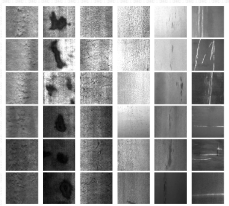
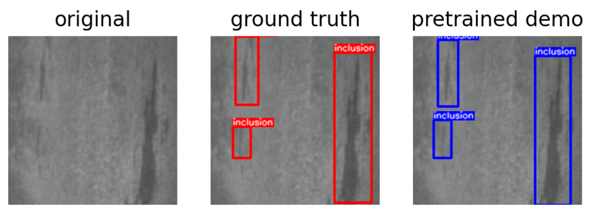
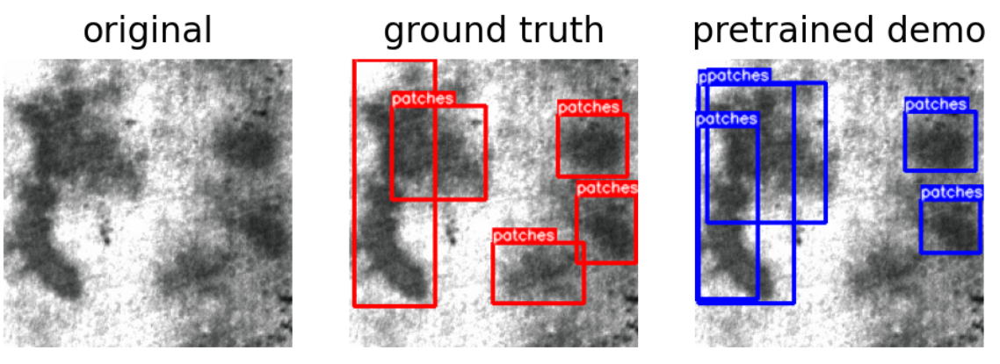
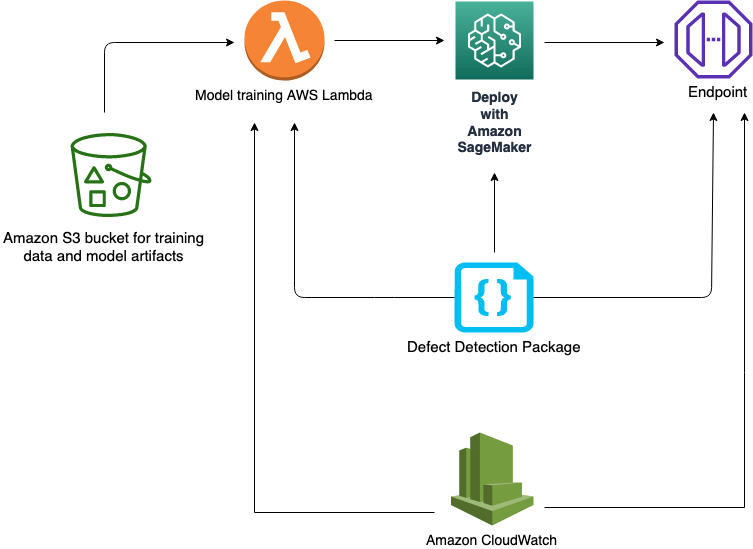

# Visual Inspection Automation with Amazon SageMaker

  
  
  
   
  
  
 

This solution detects product defects with an end-to-end Deep Learning workflow for quality control in manufacturing process. The solution takes input of product images and identifies defect regions with bounding boxes. In particular, this solution uses an implementation of  [An End-to-End Steel Surface Defect Detection](https://ieeexplore.ieee.org/document/8709818) on [NEU surface defect database](https://github.com/awslabs/sagemaker-defect-detection/blob/mainline/docs/NEU_surface_defect_database.pdf) (see [references](#references)) in [PyTorch](https://pytorch.org/) using [PyTorch-lightning](https://github.com/PyTorchLightning/pytorch-lightning).

## Background

According to the [Gartner](https://www.gartner.com/smarterwithgartner/gartner-top-10-strategic-technology-trends-for-2020/),  hyper-automation is the number one trend in 2020 and will continue advancing in future. When it comes to manufacturing, one of the main barriers to hyper-automation is in areas where Human involvements is still struggling to be reduced and intelligent systems have hard times to become on-par with Human visual recognition abilities and become mainstream, despite great advancement of Deep Learning in Computer Vision. This is mainly due to lack of enough annotated data (or when data is sparse) in areas such as _Quality Control_ sections where trained Human eyes still dominates.

## What is Visual Inspection?

The **analysis of products on the production line for the purpose of Quality Control**. Visual inspection can also be used for internal and external assessment of the various equipment in a production facility such as storage tanks, pressure vessels, piping, and other equipment ([source](https://nanonets.com/blog/ai-visual-inspection/)) which expands to many industries from Electronics, Medical, Food and Raw Materials.

### What are the Problems?

Some of the major problems are

#### Human Visual Error

**Human visual inspection error** is a major factor in this area. According to this [report](https://www.osti.gov/servlets/purl/1476816)

> Most inspection tasks are much more complex and typically exhibit error rates of 20% to 30% (Drury & Fox, 1975)

which directly translates to *cost*.
#### Cost

According to some [estimate](https://www.glassdoor.co.in/Salaries/us-quality-control-inspector-salary-SRCH_IL.0,2_IN1_KO3,28.htm), a trained quality inspector salary varies between 26K (US) - 60K per year.

## Getting Started

You will need an AWS account to use this solution. Sign up for an account [here](https://aws.amazon.com/).

The easiest is to click on the following button to create the *AWS CloudFormation Stack* required for this solution

<table align="center">
  <tr>
    <th colspan="3">AWS Region</td>
    <th>AWS CloudFormation</td>
  </tr>
  <tr>
    <td>US West</td>
    <td>Oregon</td>
    <td>us-west-2</td>
    <td align="center">
      
    </td>
  </tr>
  <tr>
    <td>US East</td>
    <td>N. Virginia</td>
    <td>us-east-1</td>
    <td align="center">
      
    </td>
  </tr>
  <tr>
    <td>US East</td>
    <td>Ohio</td>
    <td>us-east-2</td>
    <td align="center">
      
    </td>
  </tr>
</table>

Then acknowledge adding the default [AWS IAM policy](https://aws.amazon.com/iam/) or use your own policy

* Click on the **Create Stack**
* Once the stack was created, go to the **Outputs tab** and click on the **NotebookInstance** link to directly go to the created notebook instance
* To see the demo, click on **0_demo.ipynb** and follow the instructions
* Checkout **1_finetune.ipynb** to finetune / resume training of the provided pretrained checkpoint
* Checkout **2_detection_from_scratch.ipynb** to train a detector from scratch
* Finally, **3_classification_from_scratch.ipynb** notebook, if you just need an accurate image classifier

## What Does this Solution Offer?

This solution offers an implementation of the state-of-the-art Deep Learning approach for automatic *Steel Surface Defect Detection* using **Amazon SageMaker**. The [model](https://ieeexplore.ieee.org/document/8709818) enhances [Faster RCNN](https://arxiv.org/abs/1506.01497) and output possible defects in an image of surface of a steel. The **NEU surface defect database**(see [references](#references)), is a *balanced* dataset which contains

> Six kinds of typical surface defects of the hot-rolled steel strip are collected, i.e., rolled-in scale (RS), patches (Pa), crazing (Cr), pitted surface (PS), inclusion (In) and scratches (Sc). The database includes 1,800 grayscale images: 300 samples each of six different kinds of typical surface defects

This solution trains a classifier on **NEU-CLS** dataset as well as a detector on **NEU-DET** dataset. Here is a sample images of the six classes

  

and here are the sample detection results

  

  

## Contents

* `cloudformation/`
    * `defect-detection.yaml`: The root cloudformation nested stack which creates the AWS stack for this solution
    * `defect-detection-sagemaker-notebook-instance.yaml`: Creates SageMaker notebook instance
    * `defect-detection-permissions.yaml`: Manages all the permission necessary to launch the stack
    * `defect-detection-endpoint.yaml`: Creates demo endpoint using in `0_demo.ipynb`
    * `solution-assistant`: Deletes the created resources such as endpoint, S3 bucket etc. during cleanup
* `src/`
    * `prepare_data/`: Data prepartion for NEU datasets
    * `sagemaker_defect_detection/`: Main package
        * `dataset`: Contains NEU dataset handling
        * `models`: Contains the MFN model code
        * `utils`: Various utilities for visualization and coco evaluation
        * `classifier.py`: For classification task
        * `detector.py`: For detection task
        * `transforms.py`: Contains the image transformations used in training
* `notebooks/`: All the notebooks described above
* `scripts/`: Various scripts for training and building

## Architecture Overview

The project

* Needs access to [Amazon S3](https://aws.amazon.com/s3/) for storing data and training artifacts
* Provides interactive **training**, **evaluation** and **visualiztions** of the results in the provided notebooks using [Amazon SageMaker](https://aws.amazon.com/sagemaker/)
* **Deplying** and testing an [HTTPS endpoint](https://docs.aws.amazon.com/sagemaker/latest/dg/how-it-works-hosting.html)
* Monitoring the deployed model via [Amazon CloudWatch](https://aws.amazon.com/cloudwatch/)

Here is the visual architecture

  

## Cleaning up

When you've finished with this solution, make sure that you delete all unwanted AWS resources. AWS CloudFormation can be used to automatically delete all standard resources that have been created by the solution and notebook. Go to the AWS CloudFormation Console, and delete the parent stack. Choosing to delete the parent stack will automatically delete the nested stacks.

**Caution:** You need to manually delete any extra resources that you may have created in this notebook. Some examples include, extra Amazon S3 buckets (to the solution's default bucket), extra Amazon SageMaker endpoints (using a custom name).

## Customization

For using your own data, make sure it is labeled and is a *relatively* balanced dataset.

## Useful Links

* [Amazon SageMaker Getting Started](https://aws.amazon.com/sagemaker/getting-started/)
* [Amazon SageMaker Developer Guide](https://docs.aws.amazon.com/sagemaker/latest/dg/whatis.html)
* [Amazon SageMaker Python SDK Documentation](https://sagemaker.readthedocs.io/en/stable/)
* [AWS CloudFormation User Guide](https://docs.aws.amazon.com/AWSCloudFormation/latest/UserGuide/Welcome.html)

### References

* K. Song and Y. Yan, “A noise robust method based on completed local binary patterns for hot-rolled steel strip surface defects,” Applied Surface Science, vol. 285, pp. 858-864, Nov. 2013.

* Yu He, Kechen Song, Qinggang Meng, Yunhui Yan, “An End-to-end Steel Surface Defect Detection Approach via Fusing Multiple Hierarchical Features,” IEEE Transactions on Instrumentation and Measuremente, 2020,69(4),1493-1504.

* Hongwen Dong, Kechen Song, Yu He, Jing Xu, Yunhui Yan, Qinggang Meng, “PGA-Net: Pyramid Feature Fusion and Global Context Attention Network for Automated Surface Defect Detection,” IEEE Transactions on Industrial Informatics, 2020.

## Security

See [CONTRIBUTING](CONTRIBUTING.md#security-issue-notifications) for more information.

## License

This project is licensed under the Apache-2.0 License.
